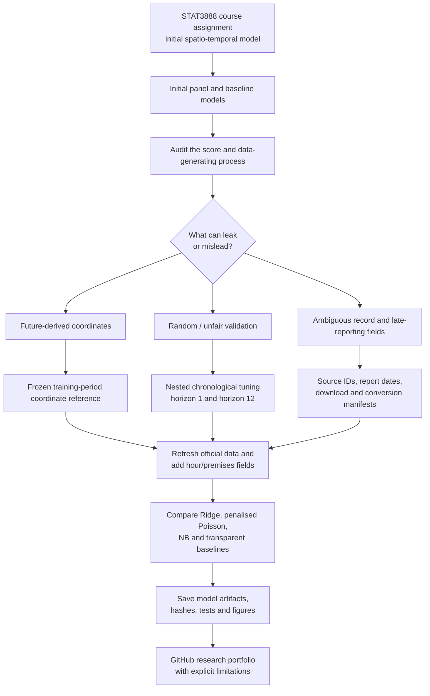

# Toronto Bicycle Theft Prediction

A spatio-temporal machine learning project that forecasts monthly published
bicycle-theft record counts across Toronto neighbourhoods, combining temporal
modelling, seasonal harmonics, and radial-basis-function spatial smoothing —
plus a descriptive hourly hotspot analysis that explores when and where thefts
concentrate within the day.

> This project began as a STAT3888 spatio-temporal data science course
> assignment and was extended into a reproducible research portfolio project.
> See the [bilingual project introduction](docs/project_introduction.md) for
> the full story, methodology, limitations, and research framing.

## Overview

This repository builds a predictive model for **monthly bicycle-theft record
rows per neighbourhood** in the City of Toronto over 2014–2025. The data are a
balanced panel (141 neighbourhood units × 144 months) with strong temporal
autocorrelation, a pronounced annual cycle, and heavy over-dispersion in the
count target. The goal is a model that generalises to *unseen future months*
rather than one that merely fits the past.

The panel has 140 named neighbourhoods plus one `NSA` ("Not Specified Area")
bucket that the publisher uses for records with no known location. `NSA` is
treated as an *unknown area*: it is retained for count reconciliation but
excluded from all spatial features (its coordinates are missing/zero and would
otherwise distort the spatial scale ~65×). See `data_dictionary.md` for the full
counting and geography calibre.

The project originated as a hands-on exercise in a spatio-temporal data science
course, and has since been reworked into a standalone predictive-modelling
project: a rigorous time-aware validation strategy, fair baseline and
multi-model comparison, nested chronological hyperparameter tuning, and
interpretable diagnostics. The dataset was subsequently refreshed from the
official open-data source (40,583 published rows, now spanning 2014–2026),
which extended the study period through 2025 and unlocked two new signal
fields — **hour of day** and **premises type** — used in the hotspot analysis.

Model selection is driven by **predeclared rolling-origin backtests** over two
separate forecast tasks — horizon 1 (predict next month) and horizon 12
(predict next year) — not by any single held-out year. Under that protocol the
two tasks select different models: the ridge-penalised Poisson regression wins
the monthly-updating task, while the ridge-on-log model wins the annual-ahead
task (see Model Comparison). Calendar 2025 is kept as a repeatedly-viewed
*retrospective* window and plays no role in selection.

## Project architecture

```mermaid
flowchart LR
    A[Official Toronto Police<br/>open-data snapshot] --> B[scripts/download_data.py<br/>ArcGIS pagination + ID completeness]
    B --> C[scripts/convert_data.py<br/>schema checks + atomic conversion]
    C --> D[data/raw/bicycle.csv<br/>and bicycle_enhanced.csv]
    D --> E[src/prepare_data.R<br/>audit + monthly panel]
    R[data/reference/<br/>neighborhood_coordinates.csv] --> E
    E --> F[src/features.R<br/>time, season, spatial, context features]
    F --> G[src/validation.R + src/backtest.R<br/>chronological folds]
    G --> H[src/models.R<br/>baselines, Ridge, Poisson, NB]
    H --> I[src/run_pipeline.R<br/>horizon-specific selection]
    I --> J[output/tables/<br/>backtests, predictions, diagnostics]
    I --> K[output/models/<br/>RDS + provenance metadata]
    K --> L[src/predict.R<br/>future forecast from cutoff]
    D --> M[src/hotspot_analysis.R<br/>descriptive hourly analysis]
    M --> N[output/figures/<br/>hour and premises plots]
    style A fill:#e8f1f5,stroke:#1b4965
    style I fill:#fff3cd,stroke:#b7791f
    style K fill:#e6f4ea,stroke:#2f855a
```



## Research journey and improvement loop



## Problem Definition

- **Task type**: supervised regression (count prediction).
- **Prediction target**: `theft_count` — the number of published record rows
  for a given neighbourhood and occurrence month. Repeated event IDs mean this
  is not yet verified as a count of distinct cases or bicycles.
- **Features**: temporal position (month index), calendar month (seasonality),
  neighbourhood identity and centroid coordinates (spatial structure), and
  neighbourhood-level context (historical share of outdoor and commercial
  thefts, learned from training data only).
- **Evaluation objective**: minimise out-of-sample prediction error on future
  months, measured by MAE, RMSE, and R². Because the target is a skewed count,
  MAE is emphasised alongside RMSE.

## Dataset

- **Source**: [Toronto Police Service — Bicycle Thefts Open Data]
  (https://data.torontopolice.on.ca/datasets/TorontoPS::bicycle-thefts-open-data)
  (also listed on the [City of Toronto Open Data Portal]
  (https://open.toronto.ca/dataset/bicycle-thefts/)). Individual incident
  records with occurrence date, neighbourhood, cost, premises type, and
  coordinates. Location coordinates are deliberately offset to the nearest road
  intersection by the publisher for privacy; all analysis is therefore at
  neighbourhood, not address, granularity.
- **Scale**: 40,524 published rows (2014–2026) → 20,304 neighbourhood-month
  observations (141 neighbourhood units × 144 months, 2014-01 to 2025-12;
  140 named neighbourhoods + the `NSA` unknown area).
- **Key variables**: `date`, `neighborhood`, `bike_cost`, `location`
  (premises category), `long`/`lat` (neighbourhood centroid), plus `hour` and
  `premises_type` from the official feed (used in the hotspot analysis).
- **Target**: `theft_count` (monthly count per neighbourhood).

The raw CSV is not redistributed in this repository. To reproduce, run
`scripts/download_data.py` followed by `scripts/convert_data.py`, which fetch
the current official dataset and convert it to the two files the pipeline
expects under `data/raw/`:

- `bicycle.csv` — schema used by the monthly model, including `objectid`,
  `event_unique_id`, occurrence/report dates and the modelling fields;
- `bicycle_enhanced.csv` — additional fields (`hour`, `premises_type`,
  `location_type`, `division`) used by the hourly hotspot analysis.

## Data Preparation

- **Schema validation**: the raw CSV is checked for the required columns.
- **Aggregation**: incidents are aggregated into monthly counts per
  neighbourhood; months with no thefts are filled with zero so every
  neighbourhood has a complete 144-month series (balanced panel). The
  in-progress 2026 records are excluded so the panel stays balanced.
- **Availability**: converted files retain occurrence and report dates.
  `records_as_of()` can exclude records reported after a chosen cutoff. Because
  the repository has one current snapshot rather than historical snapshots,
  this is an availability filter, not a complete reconstruction of past data
  revisions.
- **Data-quality audit**: the pipeline reports missing cells, exact duplicate
  rows, quarter-field inconsistencies, implausible `bike_cost` values, and the
  number of unknown-area (`NSA`) and zero-coordinate records.
- **Coordinates**: neighbourhood centroids come from a **frozen reference
  table** (`data/reference/neighborhood_coordinates.csv`), built once from the
  2014–2017 initial training window as the median of *valid* incident coordinates
  per neighbourhood and frozen thereafter. It is a versioned training-period
  estimate, rather than an official geographic centroid. This
  removes a subtle leakage channel: recomputing centroids from the full raw
  file would let future incidents move the spatial features of past training
  months. Records in the `NSA` unknown area (which carry zero/missing
  coordinates) are excluded from the spatial basis so a synthetic `(0,0)`
  point cannot inflate the spatial scale.

## Exploratory Data Analysis

Key findings that motivated the modelling choices:

1. **Strong seasonality**: thefts peak in the warmer months and drop sharply in
   winter, with a clear annual cycle (lag-12 autocorrelation ≈ 0.85).
2. **Strong temporal autocorrelation**: month-to-month persistence is high
   (lag-1 autocorrelation ≈ 0.83), ruling out random train/test splits.
3. **Heavy over-dispersion**: the target's variance-to-mean ratio is ≈ 12.8,
   far above the Poisson assumption of 1, and ~55% of observations are zero.
4. **Clear spatial hotspots**: a small number of neighbourhoods (e.g. the
   waterfront and downtown corridors) account for a disproportionate share of
   thefts.
5. **A sustained citywide decline**: thefts peaked in 2018 (~3,990/year) and
   have fallen every year since, reaching ~2,125 in 2025 — a decade low. This
   structural drift directly affects how well any historically-trained model
   can predict the latest year (see Error Analysis).

## Validation Strategy

This is the most important design decision in the project.

The panel has **temporal dependence** (high autocorrelation and annual
periodicity) and **spatial dependence** (persistent neighbourhood-level
differences). A random `train_test_split` would leak future observations into
training and inflate scores, so the project uses a purely chronological scheme.

**Two separate forecast tasks** are evaluated, and never merged into one
conclusion:

- **Horizon 1 (monthly updating)** — each origin refits on all prior months
  and predicts the next month. Twelve monthly rolling origins cover calendar
  2024 (the last year of the training span), sampling every season.
- **Horizon 12 (annual planning)** — each origin refits on all prior months
  and predicts the next 12 months at once. Six expanding annual origins cover
  2019–2024.

**Hyperparameter tuning is nested and chronological**: for every outer origin,
each tuned model's λ is selected by expanding-window *inner* folds inside that
origin's training window only (same 14-point λ grid for every tuned model,
RMSE primary metric, tie-break = strongest regularisation within 1% of the best
RMSE). No random K-fold is used anywhere; the full per-origin tuning trail is
saved to `output/tables/tuning_traces.csv`.

**Model-selection rule (predeclared)**:

> Primary metric: mean outer-fold RMSE, per horizon.
> Tie-break: lower mean MAE when mean RMSE differs by less than 1%.
> Selection is made per horizon; if the horizons disagree, both selections are
> reported — no global champion is forced.
> 2025 retrospective scores are descriptive and do not change selection.

**Retrospective window**: calendar year **2025** is held out from all training
and tuning. It has, however, been *viewed repeatedly* across earlier diagnostic
rounds of this project, so its scores are reported as descriptive retrospective
evidence only — never as a "never touched" estimate and never as an input to
selection.

Crucially, the spline boundary knots, spatial centres, neighbourhood context
features, and all λ choices are **re-fit on each fold's training data only**,
so early folds do not silently assume knowledge of the full timeline (which
would otherwise cause explosive extrapolation and leakage).

## Baseline Models

Three simple baselines establish a lower bound:

| Baseline | Description |
|---|---|
| Global mean | Predict the citywide mean theft count for every cell |
| Neighbourhood mean | Predict each neighbourhood's historical mean |
| Recent 12-mo mean | Predict each neighbourhood's mean over its most recent 12 training months |
| Seasonal naive | Same neighbourhood, same month one year earlier |

The seasonal naive baseline is again strong (test R² ≈ 0.62), underscoring how
much signal lives in the annual cycle. The recent-12-month mean is a realistic
deployment baseline that tracks the ongoing decline better than a full-history
mean (test R² 0.581).

## Models

Candidate models, all evaluated under the same rolling-origin backtests and
the same nested chronological tuning protocol:

- **Basis OLS (log)** — ordinary least squares on `log1p(theft_count)`.
- **Basis Ridge (tuned)** — ridge-regularised least squares on
  `log1p(theft_count)`; λ tuned per outer origin.
- **Poisson (compact)** — penalised Poisson regression (log link) on the compact
  basis (time + seasonality + spatial RBF, no neighbourhood one-hot).
- **Poisson (area, tuned)** — penalised Poisson with the full basis including
  the neighbourhood one-hot block; λ tuned per outer origin through the same
  grid, inner folds, metric and tie-break as the ridge model. A candidate
  count-mean model with a log link; it does **not** by itself resolve
  zero-inflation, and standard Poisson does not model over-dispersion.
- **Negative-binomial** — NB regression (`MASS::glm.nb`) on the compact basis to
  absorb over-dispersion.

The basis design matrix contains: temporal cubic B-splines, annual sine/cosine
harmonics, spatial radial basis functions over normalised coordinates,
neighbourhood one-hot indicators, and two neighbourhood-level context features
(historical outdoor/commercial theft shares learned from training data only).

## Model Comparison

Selection follows the predeclared rule (mean outer-fold RMSE per horizon;
tie-break mean MAE within 1%). Full per-fold results:
`output/tables/backtest_folds.csv`; summaries: `backtest_summary.csv`.

**Horizon 1 — monthly updating** (12 rolling origins over 2024):

| Model | mean MAE | mean RMSE (±sd) | mean R² | mean total bias | worst-fold RMSE |
|---|---:|---:|---:|---:|---:|
| **Poisson (area, tuned)** ✓ selected | **1.01** | **1.56 ± 0.50** | **0.745** | **+17.0%** | 2.36 |
| Basis Ridge (tuned) | 0.905 | 1.61 ± 0.57 | 0.738 | −4.0% | 2.87 |
| Basis OLS (log) | 0.906 | 1.61 ± 0.56 | 0.734 | −3.6% | 2.83 |
| Recent 12-mo mean | 1.11 | 2.07 ± 0.57 | 0.241 | +40.0% | 3.22 |
| Neighbourhood mean | 1.25 | 2.20 ± 0.58 | −0.036 | +64.4% | 3.28 |
| Seasonal naive | 1.23 | 2.31 ± 0.81 | 0.447 | +8.0% | 3.42 |
| Poisson (compact) | 1.42 | 2.51 ± 0.99 | 0.448 | +8.1% | 4.11 |
| Negative-binomial | 1.47 | 2.65 ± 1.16 | 0.377 | +16.8% | 4.44 |
| Global mean | 2.17 | 3.57 ± 1.19 | −0.196 | +64.4% | 5.92 |

**Horizon 12 — annual planning** (6 expanding annual origins, 2019–2024):

| Model | mean MAE | mean RMSE (±sd) | mean R² | mean total bias | worst-fold RMSE |
|---|---:|---:|---:|---:|---:|
| **Basis Ridge (tuned)** ✓ selected | **1.38** | **2.93 ± 0.80** | **0.613** | **−5.9%** | 3.85 |
| Seasonal naive | 1.46 | 2.93 ± 0.36 | 0.605 | +6.9% | 3.44 |
| Basis OLS (log) | 1.39 | 2.94 ± 0.78 | 0.609 | −4.6% | 3.84 |
| Neighbourhood mean | 1.55 | 3.10 ± 0.55 | 0.570 | +12.4% | 3.81 |
| Recent 12-mo mean | 1.53 | 3.10 ± 0.59 | 0.569 | +6.9% | 3.85 |
| Poisson (area, tuned) | 1.64 | 3.65 ± 2.27 | 0.271 | +11.1% | 7.87 |
| Global mean | 2.48 | 4.72 ± 0.68 | −0.005 | +12.4% | 5.82 |
| Poisson (compact) | 2.72 | 5.93 ± 5.11 | −1.44 | +58.8% | 16.3 |
| Negative-binomial | 3.82 | 8.86 ± 8.30 | −5.04 | +116.3% | 25.4 |

Reading of the two tables:

- **Horizon 1 selects the penalised Poisson** (RMSE 1.56 vs ridge 1.61, a 3.2%
  margin, above the 1% tie-break band). Monthly refitting lets its conditional-
  mean count link track the level closely.
- **Horizon 12 selects the tuned ridge-on-log**, via the tie-break over the
  seasonal naive baseline (equal mean RMSE 2.93, lower mean MAE 1.38 vs 1.46).
  On the annual task the ridge is far more stable fold-to-fold (sd 0.80 vs
  Poisson's 2.27; worst fold 3.85 vs 7.87).
- The two horizons therefore name **different** models; both are reported.

**Fairness note**: the count GLMs (`Poisson (compact)`, `Negative-binomial`)
use the compact feature set (time + seasonality + spatial RBF, *no*
neighbourhood one-hot) because unpenalised MLE cannot handle the rank-deficient
one-hot block — `glmnet` 5.0 also has no negative-binomial family, so NB uses
`MASS::glm.nb` and cannot be penalised. `Poisson (area, tuned)` closes that gap
with the one-hot block *plus a ridge penalty*, tuned under the identical
protocol as the ridge model (same grid, inner folds, metric, tie-break).

## Hourly Hotspot Analysis (operational extension)

The refreshed dataset includes `OCC_HOUR` and `PREMISES_TYPE`, which the
monthly panel discards. `src/hotspot_analysis.R` provides a descriptive view
of these fields for complete calendar years 2014–2025:

- **Highest recorded hours**: 18:00, 17:00 and 12:00 have the largest row
  counts in the frozen snapshot. These counts do not adjust for exposure,
  reporting behaviour or the number of bicycles present.
- **Premises mix shifts by time of day**: outdoor theft dominates during
  daylight and evening hours (~30–33% of thefts), while apartment/house theft
  dominates overnight (~56% combined between 00:00–05:00).

These patterns can motivate operational hypotheses, but this observational
analysis does not estimate the effect or cost effectiveness of patrol changes.

## Interpretation

- **Neighbourhood identity is the single most informative signal.** Models that
  omit neighbourhood fixed effects (`Poisson (compact)`, `Negative-binomial`)
  collapse (2025 retrospective R² 0.38 / 0.31), confirming that theft risk is strongly and
  persistently localised — this holds for count models too, not just linear ones.
- **Seasonality is the second key driver.** The seasonal naive baseline already
  reaches R² ≈ 0.62, and the model's sine/cosine harmonics capture the annual
  cycle cleanly.
- **The long-term trend is now explicitly downward** — captured by the
  B-splines, but a smooth trend cannot fully absorb a structural decline that
  steepens near the end of the training window.

## Error Analysis

Retrospective 2025 scores (descriptive only; models refit on 2014–2024, per
`output/tables/retrospective_2025.csv`):

| Model | MAE | RMSE | R² | total bias |
|---|---:|---:|---:|---:|
| Poisson (area, tuned) | 1.06 | 1.69 | 0.754 | **+28.9%** |
| Basis Ridge (tuned) | 0.83 | 1.98 | 0.661 | **−37.4%** |

- **Training-only back-transform corrections do not improve the annual
  backtest overall.** Across the six horizon-12 folds, naive Ridge has mean
  RMSE 2.931 and mean total bias −5.9%; log-normal and Duan-smearing
  corrections have RMSE 3.021/3.026 and bias +12.8%/+13.5%. Corrections help
  some under-predicted folds and harm over-predicted folds. The experiment in
  `output/tables/backtransform_corrections.csv` therefore rejects a simple
  global multiplicative correction and provides no causal decomposition of
  the 2025 gap.
- **Residuals are approximately centred** near zero on the count scale for
  the selected models, indicating low average cell-level bias.
- **Largest absolute errors occur at high-count cells**: the target is a
  skewed count, so absolute error grows with the magnitude of the true count.
- **The ridge model tends to smooth peaks** — extremely high months are
  under-predicted, a known limitation of shrinkage on the log target.
- **The Poisson model is the mirror image**: it tracks the level on the
  monthly task but overshoots the 2025 total by ~29%, and its horizon-12
  fold-to-fold variance is large (sd 2.27, worst fold 7.87) — see the
  Model Comparison tables.

*Calibration note*: any calibration parameter (e.g. a multiplicative correction
to fix the citywide total) must be learned from training data or a time-ordered
hold-out only, never fitted on the 2025 totals and then evaluated on the same
year.

## Limitations

- **Count distribution**: the target is zero-inflated and over-dispersed. The
  penalised Poisson model does not model zero-inflation explicitly, and the
  over-dispersed NB model is not yet competitive under a fair feature/tuning
  budget (glmnet 5.0 lacks a negative-binomial family, so NB cannot use the
  same penalised one-hot block). A penalised zero-inflated NB model is a natural
  future extension.
- **Location precision**: the publisher offsets coordinates to the nearest
  intersection for privacy; the analysis is valid at neighbourhood granularity
  but not at address level.
- **External covariates**: weather, population density, policing effort, and
  bike-infrastructure changes are absent from the dataset.
- **Late reporting and revisions**: occurrence-month backtests use the current
  snapshot. Report-date filtering is available, but exact historical database
  states require versioned snapshots that are not available here.
- **Repeatedly-viewed retrospective window**: the 2025 year has been reused
  across diagnostic rounds, so its scores are descriptive evidence, not a
  clean untouched hold-out. The rolling-origin backtests (not 2025) drive
  model selection.
- **Horizon-12 instability of the count model**: the penalised Poisson's
  annual-ahead errors vary widely across folds (RMSE sd 2.27, worst fold
  7.87), so the horizon-1 selection should not be extrapolated to annual
  planning use.
- **Structural decline**: theft volume has fallen ~47% from the 2018 peak.
  Models trained on history inherit that history's level; on 2025 the ridge
  model under-predicts the total by ~37% while the Poisson model over-predicts
  it by ~29%. How much of the ridge's gap is back-transform bias versus
  genuine level shift is an open question (see Error Analysis).

## Future Improvements

- **Conditional calibration**: investigate time-varying or conditional
  calibration only after pre-registering it in nested backtests; global
  log-normal and Duan corrections did not improve mean annual RMSE.
- **Penalised zero-inflated / negative-binomial** model to explicitly handle the
  ~55% zeros and over-dispersion (needs a package that penalises a NB/zio family).
- **Online/rolling retraining** to track the sustained decline in theft volume.
- **External covariates**: weather, holidays, and neighbourhood demographics.
- **Daily or hourly prediction granularity** — the dataset now supports it, and
  the hotspot analysis shows strong within-day structure worth modelling.
- **Uncertainty quantification**: prediction intervals via bootstrap or
  conformal methods.
- **Deployment**: retrain on a rolling window and forecast the next month for
  city resource planning.

## Automated refresh and forecasting

The repository includes two scheduled GitHub Actions. `monthly-data-refresh`
downloads the official ArcGIS snapshot, verifies pagination and identifiers,
converts it atomically, and opens a reviewable pull request containing only
`output/data_refresh_manifest.json` (large raw CSV files stay out of git).
`annual-forecast` runs on 7 January, requires all twelve occurrence months of
the configured complete year, reruns the chronological pipeline, and opens a
pull request with the next-year forecast CSV, manifest, and model metadata.
Both workflows can also be started manually. They never silently overwrite
`main`; a human reviews and merges each pull request. A fresh snapshot is not
evidence that the target is a distinct-crime count: the project continues to
forecast published record rows, as documented below.

## Repository Structure

```

├── README.md
├── data_dictionary.md   # counting / time / geography / duplication calibre
├── requirements.txt
├── renv.lock             # pinned R dependency graph
├── LICENSE               # MIT license for repository code
├── .gitignore
├── data/
│   └── raw/            # place downloaded CSVs here (not committed)
├── scripts/
│   ├── download_data.py   # fetch the official dataset (ArcGIS API)
│   └── convert_data.py    # convert to the pipeline's schemas
├── src/
│   ├── config.R           # paths, package deps, seed
│   ├── prepare_data.R     # load, audit, monthly panel
│   ├── features.R         # basis-function design matrix
│   ├── validation.R       # time-aware split + expanding-window CV
│   ├── models.R           # baselines and candidate models
│   ├── evaluate.R         # comparison & final evaluation
│   ├── backtest.R         # rolling-origin backtest engine (per horizon)
│   ├── visualize.R        # EDA and diagnostic figures
│   ├── hotspot_analysis.R # hourly/premises operational analysis
│   ├── backtransform_bias.R # training-only correction experiment
│   ├── artifacts.R        # serialisable model fit/predict contract
│   ├── predict.R          # forecast from a saved artifact
│   └── run_pipeline.R     # end-to-end entry point
├── test/
│   ├── helper.R           # synthetic-data builders
│   ├── run_tests.R        # R test entry point
│   ├── test-data-quality.R  # NSA / coordinate / panel tests
│   ├── test-leakage.R       # future-perturbation invariance
│   ├── test-validation.R    # expanding-window fold tests
│   ├── test-tuning.R        # nested chronological tuning tests
│   ├── test-backtest.R      # backtest engine tests
│   ├── test-completion.R    # metric/artifact/as-of boundary tests
│   ├── test_scripts.py      # downloader error-handling tests
│   └── test_conversion.py   # conversion and completeness tests
└── output/
    ├── figures/        # generated figures
    ├── models/         # local RDS models + committed provenance metadata
    ├── tables/         # audits, backtests, tuning traces and predictions
    └── run_manifest.json
```

## Reproducibility

- **Language**: R (>= 4.2) for modelling; Python 3 for the data download and
  conversion scripts (standard library only).
- **Dependencies**: `renv.lock` pins the complete package graph. Restore it
  with `install.packages("renv")` followed by `renv::restore()`.
- **Tests**: run the full suite from the project root:
  ```bash
  Rscript test/run_tests.R                 # R data/leakage/validation tests
  python3 -m unittest discover -s test -p 'test_*.py' -v
  Rscript test/smoke_pipeline.R            # prepare/tune/save/reload/predict
  ```
- **Fetch and prepare the data** (requires internet):
  ```bash
  python3 scripts/download_data.py   # writes data/raw/bicycle_raw_latest.csv
  python3 scripts/convert_data.py    # writes bicycle.csv + bicycle_enhanced.csv
  ```
- **Run the monthly pipeline** from the project root:
  ```bash
  Rscript src/run_pipeline.R
  ```
- **Use a saved model artifact** (forecast is relative to its recorded training
  cutoff):
  ```bash
  Rscript src/predict.R output/models/basis_ridge_tuned_.rds 12 output/forecast.csv
  ```
- **Run the hourly hotspot analysis**:
  ```bash
  Rscript src/hotspot_analysis.R
  ```
- **Random seed**: a fixed seed (`2023`) is set in `src/config.R` for
  reproducible fold assignment and any stochastic fitting.

## Key Takeaways

1. **Validation must respect the data's structure.** With strong temporal and
   spatial dependence, chronological expanding-window CV is essential; random
   splits would leak information and overstate performance.
2. **Neighbourhood and seasonality dominate the signal.** The selected models'
   predictive power comes chiefly from spatial fixed effects and the annual
   cycle, not from complex non-linearities — this holds for count models too.
3. **Match the model to the forecast horizon.**
   On the monthly-updating task a count link (Poisson, predicting `E[Y]`
   directly) has the best RMSE once the count model is given the same spatial
   structure and tuning protocol. On the
   annual-ahead task the same Poisson model is unstable and the tuned
   ridge-on-log wins on the tie-break. The earlier "ridge-on-log wins"
   conclusion was an artefact of an unfair comparison; "Poisson always wins"
   would be equally wrong.
4. **Baselines matter.** A seasonal naive model already explains ~62% of
   variance on the 2025 retrospective; any candidate model must convincingly
   beat it to justify its complexity — on horizon 12 the ridge only does so
   via the tie-break.
5. **Calibration must be tested out of sample.** Global training-only
   back-transform corrections improved some annual folds but worsened others,
   raising mean RMSE. The project therefore retains the uncorrected Ridge and
   does not assign the 2025 gap to a single cause.
